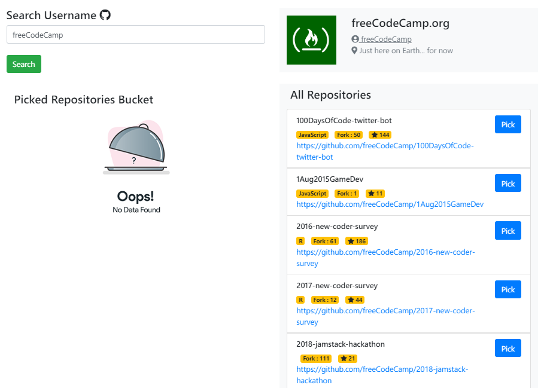
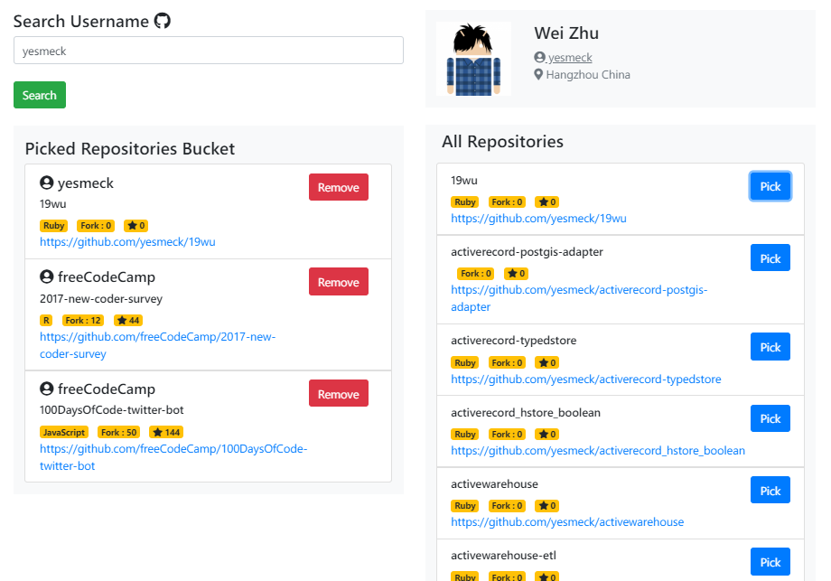

# Github Repositories Picking App

An angular app which uses github api to get basic user details and have an option to pick the repositories

## Screen Shots
| Default Page | Picked Repositories |
| -------|--------------|
|  |  |

## Functionality
* Can get user details by username
* Can see all the user repositories with star_count, fork_count and language
* Option of pick repo with username, star_count, fork_count and language
* Can remove the repo from picked repositories

## Development server

Run `ng serve` for a dev server. Navigate to `http://localhost:4200/`. The app will automatically reload if you change any of the source files.

## Build

Run `ng build` to build the project. The build artifacts will be stored in the `dist/` directory. Use the `--prod` flag for a production build.

## Running unit tests

Run `ng test` to execute the unit tests via [Karma](https://karma-runner.github.io).

## Running end-to-end tests

Run `ng e2e` to execute the end-to-end tests via [Protractor](http://www.protractortest.org/).
